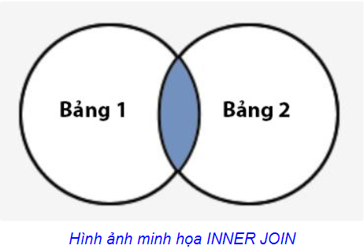
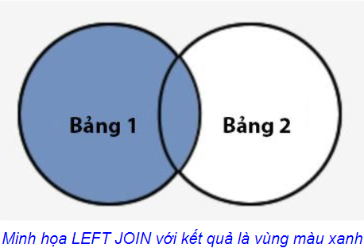
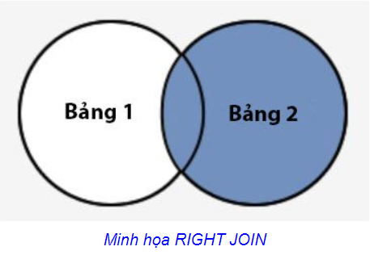
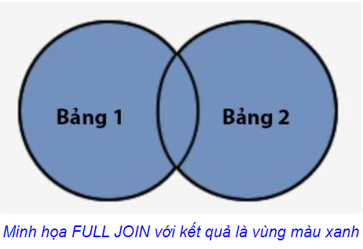

## Database (Cơ sở dữ liệu)

  ***I. Các lệnh JOIN***  

   **1. INNER JOIN** 

   - Khái niệm:  

     > Đây là loại kết nối phổ biến nhất, trả về tất cả các hàng từ các bảng khi điều kiện kết nối được đáp ứng.
   - Cú pháp:

     ```SQL
     SELECT cot
     FROM bang1
     INNER JOIN bang2
     ON bang1.cot = bang2.cot;     
     ```
   - Ảnh minh họa:   
     
   - Kết quả trả về là những bản ghi chung giữa `bang1` và `bang2`.
   

   **2. LEFT JOIN**

   - Khái niệm:  

     > Kiểu kết nối này trả về các hàng nằm ở bảng bên trái trong điều kiện `ON` và chỉ lấy ở các bảng còn lại những hàng đáp ứng được điều kiện đặt ra.
   - Cú pháp:

     ```SQL
     SELECT cot
     FROM bang1
     LEFT [OUTER] JOIN bang2
     ON bang1.cot = bang2.cot;     
     ```
   - Ảnh minh họa:   
     
   - Kết quả trả về gồm `bang1` và các bản ghi nằm trong `bang2` giao với `bang1` (vùng màu xanh trong hình).

  **3. RIGHT JOIN**
   
   - Khái niệm:  

     > Kiểu kết nối này trả về các hàng nằm ở bảng bên phải trong điều kiện `ON` và chỉ lấy ở các bảng còn lại những hàng đáp ứng được điều kiện đặt ra.
   - Cú pháp:

     ```SQL
     SELECT cot
     FROM bang1
     RIGHT [OUTER] JOIN bang2
     ON bang1.cot = bang2.cot;     
     ```
   - Ảnh minh họa:   
     
   - Kết quả trả về gồm `bang2` và các bản ghi nằm trong `bang1` giao với `bang2` (vùng màu xanh trong hình).

  **4. FULL JOIN**
 
   - Khái niệm:  

     > Kiểu kết nối này trả về tất cả các hàng nằm ở bảng trái và phải và giá trị `NULL` đặt ở những nơi không đáp ứng được điều kiện.
   - Cú pháp:

     ```SQL
     SELECT cot
     FROM bang1
     FULL [OUTER] JOIN bang2
     ON bang1.cot = bang2.cot;     
     ```
   - Ảnh minh họa:   
     
   - Kết quả trả về gồm tất cả bản ghi từ `bang1` và `bang2`.
 
  ***II. Subquery (Truy vấn con)***

   - Khái niệm:  

     > Truy vấn con là một truy vấn nằm trong một truy vấn khác. Bạn có thể tạo các truy vấn trong lệnh SQL. Các truy vấn con này nằm trong mệnh đề `WHERE`, `FROM` hoặc `SELECT`.
   - Mệnh đề `WHERE`
     - Thông thường truy vấn con nằm trong mệnh đề `WHERE`. Các truy vấn con này gọi là truy vấn lồng nhau hay truy vấn phụ.
     - Ví dụ:
       ```SQL
       SELECT s.sanpham_id, s.sanpham_ten
       FROM sanpham s
       WHERE s.sanpham_id IN 
       (SELECT htk.sanpham_id
       FROM hangtonkho htk
       WHERE htk.soluong > 10);
       ```
   - Mệnh đề `FROM`
     ```SQL
     SELECT nhacung.nhacung_ten, truyvancon1.tong_sl 
     FROM nhacung,
     (SELECT nhacung_id, SUM(donhang.soluong) AS tong_sl 
     FROM donhang
     GROUP BY nhacung_id) truyvancon1
     WHERE truyvancon1.nhacung_id = nhacung.nhacung_id;
     ```
   - Mệnh đề `SELECT`
     - Thường truy vấn con đặt trong mệnh đề `SELECT` để tính toán bằng các hàm tổng như `SUM`, `COUNT`, `MIN` hay `MAX` nhưng không muốn tính trong truy vấn chính.
     - Ví dụ:
       ```SQL
       SELECT n1.ho, n1.ten, 
       (SELECT MAX(luong)
       FROM nhanvien n2
       WHERE n1.nhanvien_id = n2.nhanvien_id) truyvancon2
       FROM nhanvien n1;
       ```

  ***III. Stored-Procedure và Trigger***  
   
  Tìm hiểu tại [đây](https://techtalk.vn/tim-hieu-ve-stored-procedure-trigger-trong-sql-2.html)

  ***IV. SQL, MySQL và SQL Server***

   **1. SQL (Structured Query Language)** 
 
   > `SQL` là ngôn ngữ truy vấn mang tính cấu trúc, là một loại ngôn ngữ máy tính phổ biến để tạo, sửa, và lấy dữ liệu từ một hệ quản trị cơ sở dữ liệu quan hệ. Ngôn ngữ này phát triển vượt xa so với mục đích ban đầu là để phục vụ các hệ quản trị cơ sở dữ liệu đối tượng-quan hệ. Nó là một tiêu chuẩn ANSI/ ISO.

   **2. SQL Server**
   
   > `SQL Server` là hệ quản trị database của Microsoft, bảo mật khá tốt. Microsoft SQL Server là một hệ quản trị cơ sở dữ liệu có quan hệ (tiếng Anh là Relational Database Management System hay RDBMS) được phát triển bởi Microsoft. `SQL Server` là một trong những RDBMS được phổ biến bên cạnh `MySQL`.

   **3. MySQL**
   
   > `MySQL` là hệ quản trị cơ sở dữ liệu tự do nguồn mở phổ biến nhất thế giới và được các nhà phát triển rất ưa chuộng trong quá trình phát triển ứng dụng. 

   - Vì `MySQL` là cơ sở dữ liệu tốc độ cao, ổn định và dễ sử dụng, có tính khả chuyển, hoạt động trên nhiều hệ điều hành cung cấp một hệ thống lớn các hàm tiện ích rất mạnh
   - Với tốc độ và tính bảo mật cao, MySQL rất thích hợp cho các ứng dụng có truy cập CSDL trên internet.  

  ***V. SQL và NoSQL***
  | Tham số | SQL | NoSQL |
  | :-: | :-: | :-: |
  | Định nghĩa | Cơ sở dữ liệu `SQL` chủ yếu được gọi là `RDBMS` hoặc Cơ sở dữ liệu quan hệ | Cơ sở dữ liệu `NoSQL` chủ yếu được gọi là cơ sở dữ liệu không liên quan hoặc phân tán |
  | Ngôn ngữ Query | Structured query language (SQL) | Không có ngôn ngữ query |
  | Type | `SQL` databases là cơ sở dữ liệu dựa trên bảng | `NoSQL` databases có thể dựa trên tài liệu, cặp khóa-giá trị, cơ sở dữ liệu biểu đồ |
  | Schema | `SQL` databases có lược đồ được xác định trước | `NoSQL` databases sử dụng lược đồ động cho dữ liệu phi cấu trúc |
  | Khả năng mở rộng | `SQL` databases có thể mở rộng theo chiều dọc | `NoSQL` databases có thể mở rộng theo chiều ngang |
  | Ví dụ | Oracle, Postgres, and MS-SQL | MongoDB, Redis, Neo4j, Cassandra, Hbase |
  | Phù hợp cho | Đây là 1 lựa chọn lý tưởng cho môi trường truy vấn phức tạp | Không phù hợp với truy vấn phức tạp |

  ***VI. Having và Where***

  - HAVING
    - Là câu lệnh điều kiện trả kết quả đối chiếu cho nhóm (`Sum`,`AVG`,`COUNT`,…)
    - Sau `GROUP BY` chỉ được dùng `HAVING`

  - WHERE : 
    - Là câu lệnh điều kiện trả kết quả đối chiếu với từng dòng.
    - Sử dụng trước khi gộp nhóm diễn ra
    - `Where` không dùng được sau `GROUP BY`
  
  ***VII. char và varchar***

  - char:
    - Có độ dài cố định
    - Nhanh hơn `varchar`

  - varchar: 
    - Có độ dài thay đổi theo phần tử
    - Chậm hơn `char`
