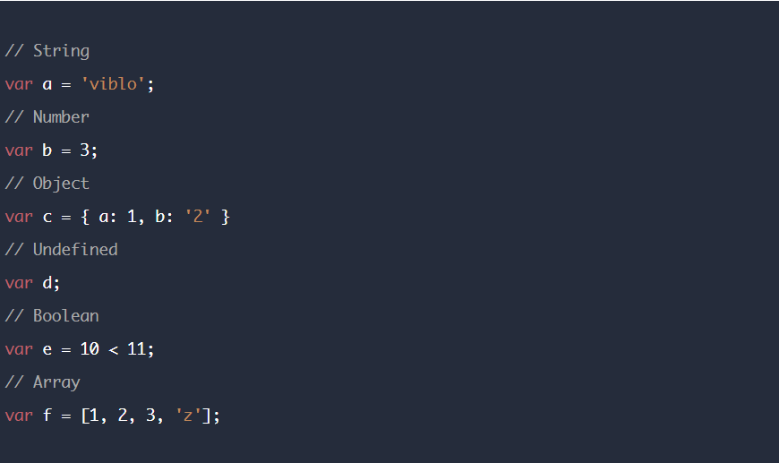
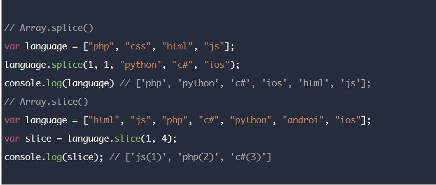
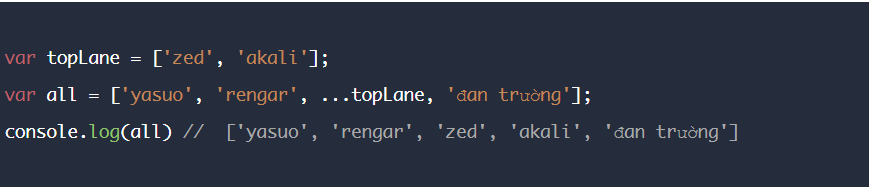

## Javascript Questions

1. Javascript là gì?

> Javascript là một ngôn ngữ lập trình kịch bản dựa vào đối tượng phát triển có sẵn hoặc tự định nghĩa ra, javascript được sử dụng rộng rãi trong các ứng dụng Website. Nó là một ngôn ngữ thông dịch.

2. Các kiểu dữ liệu trong Javascript?

> Có 6 kiểu đó là **String, Number, Object, Undefined, Boolean, Array, Null**

- Ví dụ  

3. Phân biệt var, let và const?

> **const** dùng để khai báo một hằng số – là một giá trị không thay đổi được trong suốt quá trình chạy.  
**let** tạo ra một biến chỉ có thể truy cập được trong block bao quanh nó  
**var** – tạo ra một biến có phạm vi truy cập xuyên suốt function chứa nó.

4. Khác nhau giữa **undefined** và **null** trong javascript?

> Khi tạo ra một biến mà không gán giá trị thì nó sẽ là **undefined**. Còn **null** là một **object**.

5. == và === khác nhau như thế nào?

> Trả lời: Toán tử `==` kiểm tra tính bằng nhau, còn `===` kiểm tra cả tính bằng nhau và cả kiểu dữ liệu

6. Closure trong javascript là gì?

> **Closure** là một hàm bên trong, truy cập đến các giá trị bên ngoài phạm vi của nó. **Closure** có thể truy cập vào các biến trong phạm vi của riêng nó (Variables in their own scope), trong hàm (Variables in the function’s scope), và biến toàn cục (Global variables).

7. Hoisting trong javascript là gì?

> **Hoisting** là hành động mặc định của Javascript, nó sẽ chuyển phần khai báo lên phía trên top Trong Javascript, một biến (variable) có thể được khai báo sau khi được sử dụng.

8. Hàm Array.splice() và hàm Array.slice() khác nhau như thế nào ?

> Hàm `Array.splice()` sẽ thay thế một hoặc một số phần tử của mảng bằng một hoặc một số phần tử khác. Trong khi hàm `Array.slice()` sẽ trích xuất một số phần tử của mảng, vị trí bắt đầu và kết thúc việc trích xuất sẽ được xác định bởi tham số truyền vào hàm. Lưu ý hàm sẽ trích xuất không bao gồm phần tử end truyền vào.

- Ví dụ  

9. Spread Operator trong javascript ?

> Trả lời: **Spread operator** là một biểu thức mở rộng giúp gộp các phần tử vào trong một cách viết ngắn gọn hơn. Cách viết này được thể hiện bằng dấu `...`

- Ví dụ  

