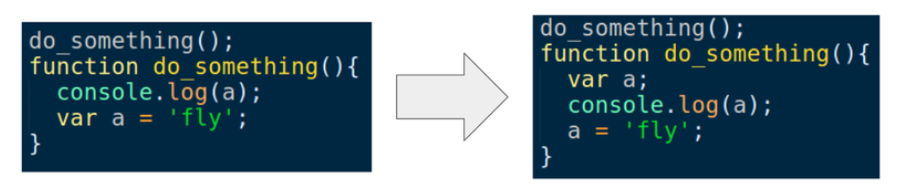
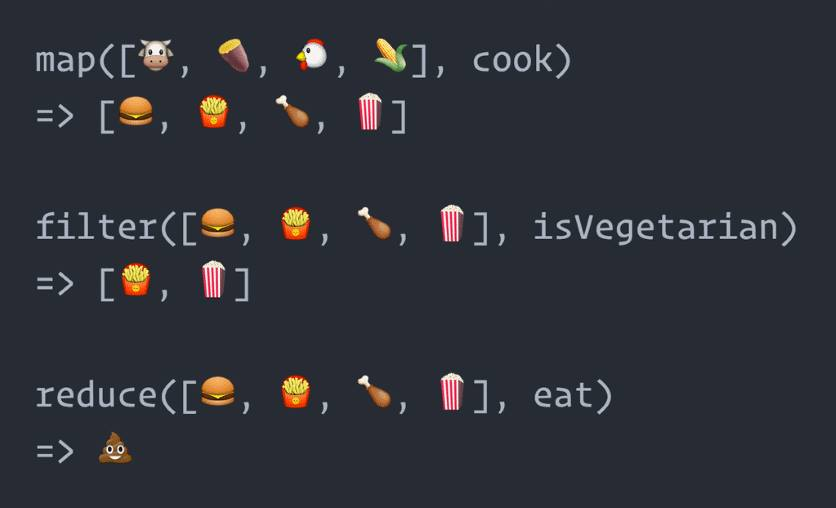

## Javascript 

  ***I. Client side và Server side***  

   **1. Client-side**   

   > **Client-side** là các hoạt động xảy ra tại trình duyệt của máy Client (máy tính của người dùng).
   
   

   **2. Server-side**   

   > **Server-side** là các hoạt động xảy ra tại Server.   
 
  ***II. Cookie và Session***

  | Cookie | Session |
  | :-: | :-: |
  | **Cookie** được lưu trữ trên trình duyệt của người dùng | **Session** không được lưu trữ trong trình duyệt người dùng |
  | Dữ liệu **cookie** được lưu trữ ở phía máy khác | Dữ liệu **session** được lưu ở phía máy chủ |
  | Dữ liệu **cookie** dễ dàng sửa đổi khi chúng được lưu trữ ở phía khách hàng | Dữ liệu **session** không dễ dàng sửa đổi vì chúng được lưu trữ ở phía máy chủ |
  | Dữ liệu **cookie** có sẵn trong trình duyệt chúng ta cho đến khi hết hạn | Dữ liệu **session** có sẵn cho trình duyệt chạy. Sau khi đóng trình duyệt sẽ mất thông tin **session** |  

  ***III. Call, Apply và Bind***  
   
   **1. Call**

   - Gọi hàm và cho phép bạn truyền vào một **object** và các đối số phân cách nhau bởi dấu phẩy (Comma)
   - `function.call(thisArg, arg1, arg2, ...)`

   **2. Apply**
     
   - Gọi hàm và cho phép bạn truyền vào một **object** và các đối số thông qua mảng (Array)
   - `function.apply(thisArg, [argsArray])`

   **3. Bind**
    
   - Trả về một hàm số mới, cho phép bạn truyền vào một **object** và các đối số phân cách nhau bởi dấu phẩy.
   - `const newFunction = fun.bind(thisArg[, arg1[, arg2[, ...]]])`

   **4. So sánh Call, Apply và Bind qua ví dụ**
   
   - Call:
     ```javascript
     const person1 = {firstName: 'Jon', lastName: 'Kuperman'};
     const person2 = {firstName: 'Kelly', lastName: 'King'};

     function say(greeting1, greeting2) {
       console.log(greeting1 + ',' + greeting2 + ' ' + this.firstName + ' ' + 
       this.lastName);
     }

     say.call(person1, 'Hello', 'Good morning'); 
     say.call(person2, 'Hello', 'Good morning'); 
     ```
   
   - Apply:
     ```javascript
     const person1 = {firstName: 'Jon', lastName: 'Kuperman'};
     const person2 = {firstName: 'Kelly', lastName: 'King'};

     function say(greeting1, greeting2) {
       console.log(greeting1 + ',' + greeting2 + ' ' + this.firstName + ' ' + 
       this.lastName);
     }

     say.apply(person1, ['Hello', 'Good moring']); 
     say.apply(person2, ['Hello', 'Good moring']); 
     ```

   - Bind:
     ```javascript
     const person1 = {firstName: 'Jon', lastName: 'Kuperman'};
     const person2 = {firstName: 'Kelly', lastName: 'King'};

     function say(greeting0, greeting1) {
     console.log(greeting0 + ',' + greeting1 + ' ' + this.firstName + ' ' + 
     this.lastName);
     }

     const sayHelloJon = say.bind(person1, 'Hello', 'Good morning');
     const sayHelloKelly = say.bind(person2, 'Hello', 'Good morning');

     sayHelloJon(); // => Hello,Good morning Jon Kuperman
     sayHelloKelly(); // => Hello,Good morning Kelly King
     ```
   

  ***IV. Hoisting***

   **1. Khái niệm**
   
   > **Hoisting** là hành động mặc định của Javascript, nó sẽ chuyển phần khai báo lên phía trên top Trong Javascript, một biến (variable) có thể được khai báo sau khi được sử dụng
   
   **2. Ví dụ**
   
   

  ***V. Closure***

   **1. Khái niệm**
   
   > Closure là một chức năng (function) có quyền truy cập vào phạm vi phụ huynh (parent scope) ngay cả khi phạm vi đã đóng.
   
   **2. Ví dụ**   
   
   - Tạo hàm **speak**: 
     ```javascript
     function speak() {
       const words = 'hi';
       return function logIt() {
         console.log(words);
       }
     }
     ```
  
   - Khai báo một biến và gán nó cho chức năng **speak**:

     ```javascript
     const sayHello = speak();
     ```
  
   - Gọi hàm **sayHello**:

     ```javascript
     sayHello();
     // 'hi'
     ```

   - Trong trường hợp này, phạm vi chức năng của `speak()` của chúng ta đã đóng. Điều này có nghĩa là các biến `const words = 'hi'` cũng nên kết thúc. 

   - Tuy nhiên, trong **JavaScript** chúng ta có khái niệm nhỏ được gọi là **Closure**: chức năng bên trong của chúng ta duy trì một tham chiếu đến phạm vi mà nó đã được tạo ra. Điều này cho phép hàm `logit()` vẫn truy cập vào các biến ngay cả sau khi `speak()` đã đóng.

  ***V. Map, Filter và Reduce***
  
    